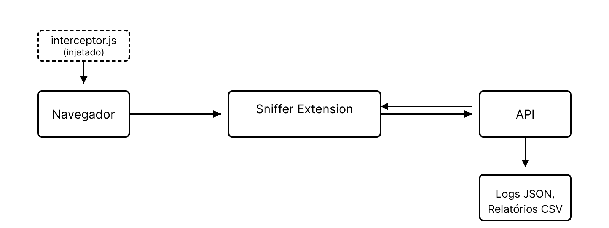

# CPCTDataSafe

**Biblioteca de auditoria de estratégias de coleta e monetização de dados de atividade online**
Inspirada no projeto da IBM [user-test-logger](https://github.com/IBM/user-test-logger).

---

## Índice

1. [Visão Geral](#visão-geral)
2. [Arquitetura do Sistema](#arquitetura-do-sistema)
3. [Fluxo de Dados](#fluxo-de-dados)
4. [Componentes Principais](#componentes-principais)

   * [API](#api)
   * [Sniffer (Extensão Chrome)](#sniffer-extensão-chrome)
5. [Interceptor.js em Detalhes](#interceptorjs-em-detalhes)

   * [Processo de Injeção](#processo-de-injeção)
   * [Comunicação com Outras Partes](#comunicação-com-outras-partes)
6. [Guia de Instalação e Uso](#guia-de-instalação-e-uso)


---

## Visão Geral

O **CPCTDataSafe** é uma ferramenta de captura que intercepta em tempo real a coleta de dados pessoais de telemetria e comportamento pelas Big Tech's: 

* Captura de eventos de usuário (cliques, rolagens, foco, etc.)
* Interceptação de requisições de rede (fetch e XHR)
* Geração de arquivos JSON brutos e relatórios consolidados em CSV

O componente central de interceptação é o **`interceptor.js`**, responsável por “injetar” código diretamente no contexto da página para monitorar todas as chamadas de rede.

---

## Arquitetura do Sistema

1. **Extensão Chrome (Sniffer)**

   * **Background Script**: gerencia a autenticação e comunicação com a API.
   * **Content Script**: injeta o `interceptor.js`.
   * **Interceptor Script**: roda diretamente na página.
   * **Popup/UI**: interface para login, estatísticas e exportação de dados.

2. **Servidor API**

   * **Endpoints REST**: recebem e autenticam pacotes de dados.
   * **Processamento de Payload**: valida, enriquece e formata dados.
   * **Armazenamento**: persiste JSON brutos e gera CSV consolidados.

Visualização simplificada:



## Fluxo de Dados

1. **Captura de Evento**: o usuário interage com a página (clique, rolagem, foco).
2. **Content Script**: registra eventos e injeta o `interceptor.js`.
3. **Interceptor.js**: coleta dados de rede.
4. **Comunicação Interna**: `interceptor.js` envia mensagens para o Content Script; em seguida, o Background Script dispara chamadas para a API.
5. **API**: gera logs JSON e atualiza CSV.

---

## Eventos Capturados pelo CPCTDataSafe

O **CPCTDataSafe** captura aproximadamente **20 tipos diferentes de eventos**, agrupados em quatro categorias principais:

### 1. Eventos de Interação do Usuário

* **click**: Cliques do mouse em elementos da página
* **keyInput**: Entrada de texto em campos (agrupada para eficiência)
* **keyDownSpecific**: Teclas específicas como Enter e Tab
* **scroll**: Rolagem da página
* **mouseMovement**: Movimento do cursor do mouse
* **change**: Alterações em campos de formulário
* **windowFocus**: Quando a janela/aba ganha foco
* **windowBlur**: Quando a janela/aba perde foco

### 2. Eventos de Rede

* **fetch**: Requisições usando a API Fetch
* **fetchError**: Erros em requisições Fetch
* **xhr**: Requisições usando XMLHttpRequest
* **xhrError**: Erros em requisições XHR
* **timeout**: Timeouts em requisições XHR

### 3. Eventos de Sistema e Diagnóstico

* **contentScriptInitialized**: Inicialização do content script
* **scriptInjected**: Confirmação de injeção bem-sucedida do interceptor
* **diagnosticEvent**: Eventos de diagnóstico do sistema
* **internalContentScriptError**: Erros internos do content script
* **pageError**: Erros JavaScript na página, incluindo rejeições de promises não tratadas

### 4. Eventos de Metadados e Conteúdo

* **pageMetadata**: Metadados da página (título, URL, referenciador, metatags, etc.)
* **documentContent**: Conteúdo de documentos (especialmente em aplicativos Google como Docs, Sheets)

Cada evento capturado inclui essas informações:

* Timestamp preciso
* ID de correlação para relacionar eventos
* Contexto da página (URL, título, serviço identificado)
* Informações do alvo da interação (para eventos de usuário)
* Dados de performance do navegador

---

## Componentes Principais

### API

* **Linguagem/Framework**: Python (Flask).
* **Endpoint Principal**: `/data` (POST).
* **Fluxo Interno**:

  1. Autenticação via Bearer token.
  2. Persistência:

     * JSON brutos no diretório data.
     * Consolidação e simplificação dos json's por usuário no diretório `user_csvs` com apontamento para os arquivos originais.

### Sniffer (Extensão Chrome)

#### Content Script (`content-script.js`)

* Carregado conforme `matches` no `manifest.json`.

* Injeta dinamicamente o `interceptor.js` no DOM.

* Monitora `window.postMessage` para capturar dados enviados pelo `interceptor.js`.

#### Background Script (`background.js`)

* Recebe mensagens do Content Script.
* Acumula e envia lotes de dados (ou individualmente) para a API.

#### Configuração (`manifest.json`)

```json
{
  "manifest_version": 3,
  "name": "CPCTDataSafe Sniffer",
  "permissions": ["webRequest","tabs","scripting","storage","activeTab"],
  "host_permissions": ["<all_urls>"],
  "background": {"service_worker": "background.js"},
  "content_scripts": [{"matches":["<all_urls>"],"js":["content-script.js"]}]
}
```

---

## Interceptor.js em Detalhes

O **`interceptor.js`** é injetado no contexto da página para monitorar chamadas de rede que não são possíveis capturar com content-script.

### Processo de Injeção

1. Content Script cria `<script>` apontando para `interceptor.js`.
2. Navegador carrega e executa o arquivo no contexto da página.
3. Elemento `<script>` é removido após o `onload` — o código permanece em execução.

### Comunicação com Outras Partes

| Origem            | Destino           | Mecanismo                    |
| ----------------- | ----------------- | ---------------------------- |
| interceptor.js    | Content Script    | `window.postMessage`         |
| Content Script    | Background Script | `chrome.runtime.sendMessage` |
| Background Script | API Server        | `fetch()` POST `/logs`       |

---

## Guia de Instalação e Uso

1. **Clonar repositório**:

   ```bash
   git clone https://github.com/seu-usuario/CPCTDataSafe.git
   ```

2. **API**:

   ```bash
   cd CPCTDataSafe/api
   python -m venv venv
   source venv/bin/activate
   pip install -r requirements.txt
   deactivate
   sudo venv/bin/python server.py
   ```

3. **Extensão Chrome**:

   * Acesse `chrome://extensions`, ative modo desenvolvedor.
   * Clique em "Carregar sem compactação" e selecione `CPCTDataSafe/sniffer/`.
   * No `sniffer/config.js`, defina `API_ENDPOINT` e `API_KEY`.

4. **Uso**:

   * Abra qualquer página web de host Google e capture tráfego e ações de usuário na UI.
   * Utilize o popup para visualizar estatísticas e exportar relatórios.

---

## Estrutura de Arquivos

```
CPCTDataSafe/
├─ api/
│  ├─ server.py         # Entrypoint da API
│  ├─ models.py         # Schemas e validação (pydantic)
│  ├─ storage/          # Lógica de gravação JSON e CSV
│  └─ requirements.txt  # Dependências Python
├─ sniffer/
   ├─ manifest.json     # Definições da extensão Chrome
   ├─ config.js         # Endpoint e chaves da API
   ├─ content-script.js # Injeção de interceptor e listener
   ├─ interceptor.js    # Monkey-patch de fetch/XHR
   ├─ background.js     # Agregação e envio de dados
   └─ popup/            # UI (HTML, CSS, JS)
```

**Tipos de Dados**

* **Eventos de Usuário**: click, scroll, mouseMovement, focus/blur etc.
* **Requisições de Rede**: fetch, XHR, status, duração, método.
* **Metadados**: pageContext (URL, título, viewport), performanceData, userId/tabId.

**Formato do Payload**

```json
{
  "userId": "user_12345",
  "uploadTimestamp": "2025-05-05T10:00:00.000Z",
  "userActions": [ /* array de eventos */ ],
  "requests": [ /* array de requisições */ ]
}
```
